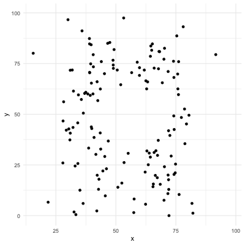
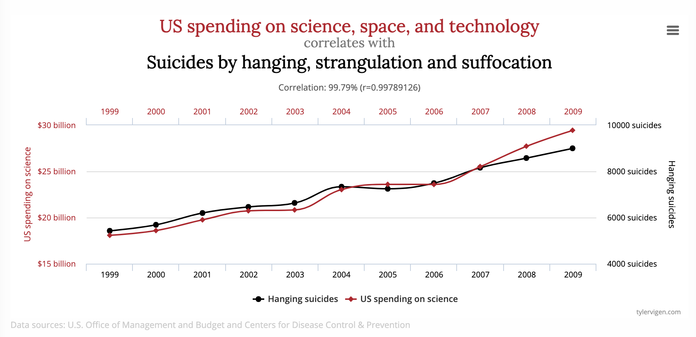
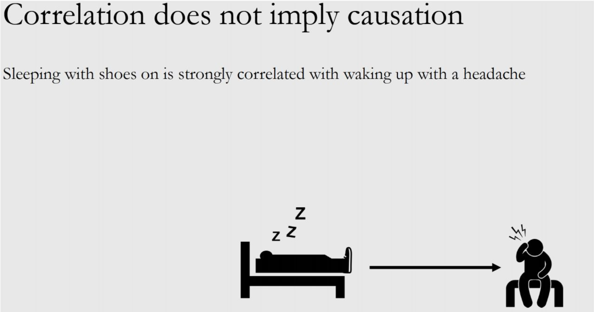
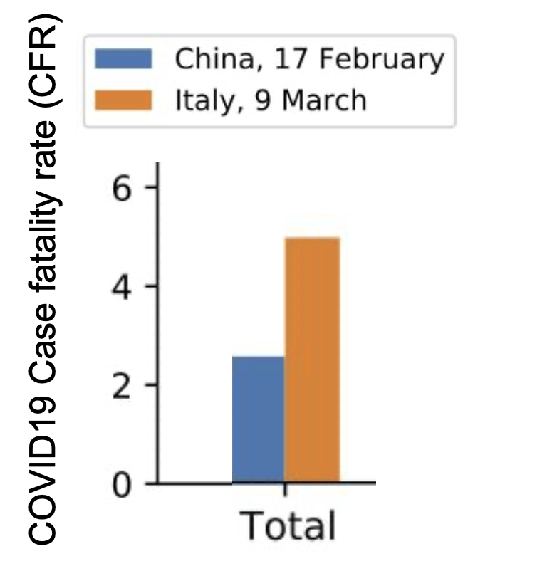
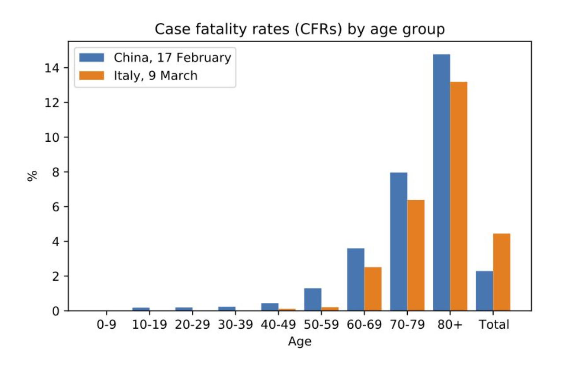
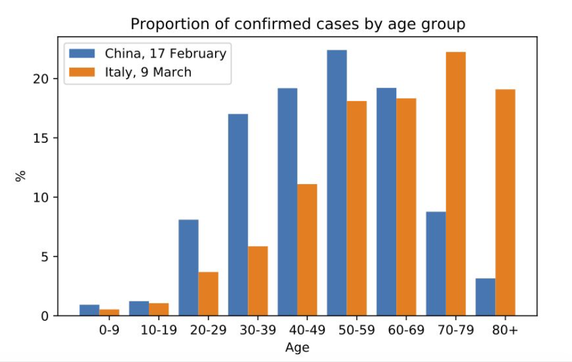
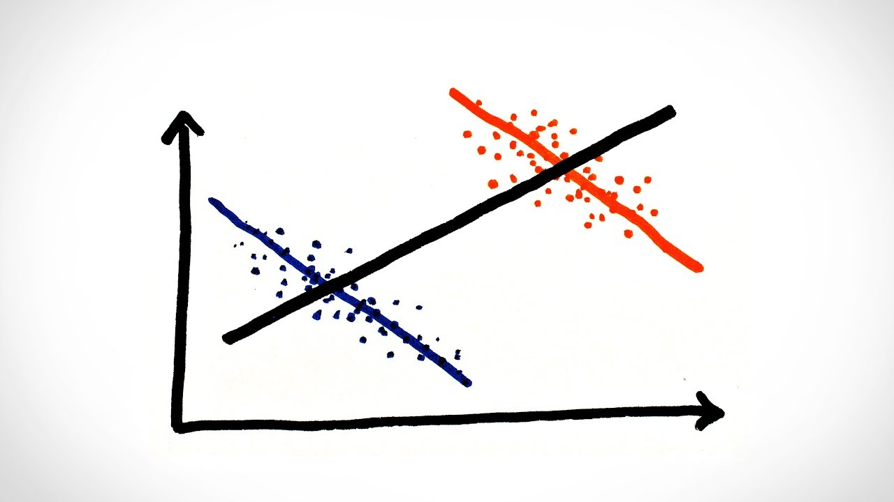
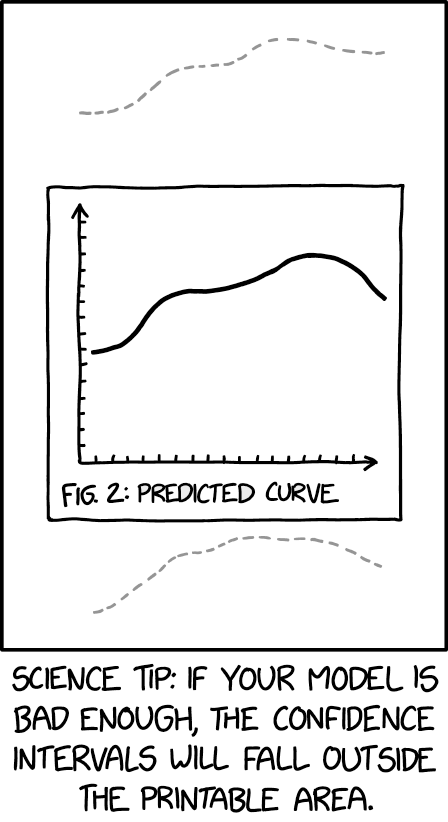
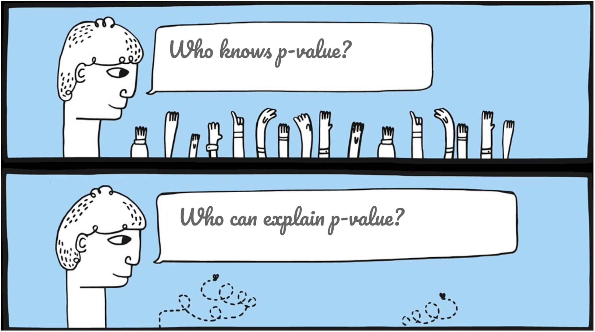

# Purpose of this class


At the end of this class you will be able to perform a ***data exploration*** in `R`. 

--

This term first appeared in a book from John Tukey (1977):

*"Practice of inspecting, and exploring your data, before stating hypotheses, fitting predictors, and other more ambitious inferential goals. It typically includes the computation of simple summary statistics which capture some property of interest in the data, and visualization."*

Note that this is *assumption-free*.

--

It includes being able to:

- Load and preview data;
- Visualize data;
- Compute basic statistical metrics such as mean, median, correlation coefficient. These are called **point estimates**;
- Understand what is behind a confidence interval;
- Run standard statistical tests;
- Be aware of typical bias (Simpson paradox);
- Understand what a p-value means.

---
# Notations


We will (try to!) have as less as possible the need of mathematical formula for this class. 

--

The core material in statistics and machine learning is *data* (and it can be dirty data!):
```{r, echo = FALSE, warning = FALSE}
library(kableExtra)
example <- read.csv("ozoneNA.csv")
example[1:4, c("WindDirection", "maxO3", "T9", "Ne9", "Vx15")] %>%
  kbl() %>%
  kable_styling()
```

--

This is the minimum notation you should keep in mind:

- $n$ is the number of observation in a data set
- $p$ is the number of covariates (= features = caracteristics) by observation 
- $X$ is usually a matrix of size $n$ x $p$ (you can also find $Y$, a vector of size $n$ x $1$, being the variable to explain). A realization of the variable can be denoted $x$
- $i$ denotes the $i^{th}$ observations, for example $x_i$ is the $i^{th}$ element of a sample.

---
# Typical statistical quantities


### Empirical mean

If we consider a random variable $X$, we would like to define its average. It can also be seen as a weighted sum of the possible values that $X$ can take.

--
Mathematically it is written:

$$\bar{x}=\frac{1}{n} \sum_{i=1}^{n} x_{i}$$

--

### Standard deviation

.pull-left[
It measures how the spread in the data.
```{r, echo=FALSE, out.width="80%", fig.cap="From sixsigmadsi.com", fig.align= "center"}
knitr::include_graphics("./img/sd.png")
```
]
.pull-right[

Using the previous notations for the expected value it gives:

$$\sigma=\sqrt{V}=\sqrt{\frac{1}{n} \sum_{i=1}^{n}\left(x_{i}-\bar{x}\right)^{2}}$$
]
---
# Why can't we just use Excel? `r emo::ji("thinking")`

These notations are the very basics for this class, and now we start a real data analysis using `R`, and not `excel`. Why?

--

- Not reproducible `r emo::ji("repeat")`
- Hard to merge different data set `r emo::ji("handshake")`
- To clean data is fastidious `r emo::ji("broom")`
- Not designed for complex visualization `r emo::ji("artist palette")`
- It is not free `r emo::ji("coin")`
- And it can be super slow `r emo::ji("turtle")`


```{r, echo=FALSE, out.width="20%", fig.cap="", fig.align= "center"}

```

--

For this class we use air pollution data, the data are stored in `ozoneNA.csv`. 

After the class you should be able to reproduce all the commands that will be shown in this class.


---
# How to load data?

(Classical) data are generally contained within a file in which the individuals are presented in rows and the variables in columns. 

--

In `R` the data are stored in an object called a `data.frame`.


--

The classical way to read a data file is to use the function `read.table` or `read.csv`.

```{r}
ozone <- read.table("ozoneNA.csv", header = TRUE, sep = ",", row.names = 1) 
```

--

Here, our data are stored in an `R` object called `ozone`. You can give the name you want to your objects `r emo::ji("baby")`, but try to be consistent and kind with an external reader.

--

Make sure you understand each parameter (`header`, `sep`, `row.names`) of the function `read.table()`. When you don't know how to use a function, you can do `?read.table()` to access the documentation.

---

# Inspect your object

- Let's look at the first 3 rows of `ozone`. (you can also do `head(ozone)`)


```{r}
ozone[1:3, 1:10] # show first 3 rows and 10 first columns
```

--

- To access one of the variable, you can use the `$` operator, for example with the temperature at 9am.

```{r}
ozone$T9[1:10] # only the first 10
```

--

Note that this is equivalent as `ozone[, "T9"]` or `ozone[, 2]`.


---

# Univariate analysis


Here we have at our disposal 112 observations collected during the summer of 2001 in Rennes. The available variables are

- maxO3 (maximum daily ozone)
- maxO3v (maximum daily ozone the previous day)
- T12 (temperature at midday)
- T9
- T15 (Temp at 3pm)
- Vx12 (projection of the wind speed vector on the east-west axis at midday)
- Vx9 and Vx15 as well as the Nebulosity (cloud) Ne9, Ne12, Ne15

--

Before any analysis an important point is to visualize the data. 
For example you can print the dimension of the dataframe stored in the object `ozone`.

```{r}
dim(ozone) 
```

---
# Univariate analysis


`summary()` details the data type of each column.
```{r}
summary(ozone[, 8:12]) # 5 last columns so that it fits in the slide but you can launch everything doing simply summary(ozone)
```

--

Can you already see difference in variable type? `r emo::ji("detective")`


---
# Useful commands


All the column names can be retrieved with the command `names()`.

```{r}
names(ozone)
```

Basic statistics can be computed:

```{r}
mean(ozone$maxO3, na.rm = TRUE)
```

--

Note that the option `na.rm = TRUE` is necessary because the data contain missing value. If not the output will be a missing value.

--

All the basics statistics are implemented such as `sd()`, `min()`, `median()`, or `max()`.
---

# Two important data types

The data can be of two types: 

- **Qualitatives** 

  *For example colors, or gender.*

- **Quantitatives**

  *For exemple a salary, or heigth.*

--

`r emo::ji("warning")` You have to be careful, whenever you replace colors by numbers (for example red with 0 and blue with 1), the data type will be set to numerical (so quantitative) and the computer can do operation on it. For example blue will be considered bigger than red, which has no meaning.

--

`r emo::ji("idea")` The command `summary()` already allows you to observe your data type, another command is possible with `str()`.

--

`r emo::ji("crayon")` You can change the type of your data from quantitative to qualitative using the command `factor()`.
---


# Illustration of the data type on Ozone

Inspect qualitative data is basically counting occurences:

```{r}
table(ozone$WindDirection)
```


--

You can do operation on quantitative variables:
```{r}
test <- ozone$maxO3 + ozone$T9
mean(test, na.rm = TRUE)
```

--

By the way, you can create a column composed by operation on other column such as `ozone$my_new_column <- ozone$maxO3 + ozone$T9 * ozone$T12`.

---
# Visualization in R

Remember you can draw very beautiful plots in `R`.


In this class we suggest you to use:


- `ggplot2` for static plots;

- `gganimate` if you want to do animated plots from static `ggplot`;

- `Shiny` to host dynamic visualization of your data (really great to share  visualization of a big data base within a team or for external communication). 


--

Before we detail how to do it, here are example to show you a part of what  is possible!


---
# Example 1 : time series

```{r, message=FALSE, echo=FALSE, fig.align="center", warning = FALSE}
library(ggplot2)
library(lubridate)
theme_set(theme_bw())

df <- economics[, c("date", "psavert", "uempmed")]
df <- df[lubridate::year(df$date) %in% c(1967:1981), ]

# labels and breaks for X axis text
brks <- df$date[seq(1, length(df$date), 12)]
lbls <- lubridate::year(brks)

# plot
ggplot(df, aes(x=date)) + 
  geom_line(aes(y=psavert, col="psavert")) + 
  geom_line(aes(y=uempmed, col="uempmed")) + 
  labs(title="Time Series of Returns Percentage", 
       subtitle="Drawn From Wide Data format", 
       caption="Code's source: http://r-statistics.co/", y="Returns %") +  # title and caption
  scale_x_date(labels = lbls, breaks = brks) +  # change to monthly ticks and labels
  scale_color_manual(name="", 
                     values = c("psavert"="#00ba38", "uempmed"="#f8766d")) +  # line color
  theme(panel.grid.minor = element_blank())  # turn off minor grid
```

---
# Example 2 : scatter plot

```{r, message=FALSE, echo=FALSE, fig.align="center", warning = FALSE}
library(ggExtra)
data(mpg, package="ggplot2")
# mpg <- read.csv("http://goo.gl/uEeRGu")

# Scatterplot
theme_set(theme_bw())  # pre-set the bw theme.
mpg_select <- mpg[mpg$hwy >= 35 & mpg$cty > 27, ]
g <- ggplot(mpg, aes(cty, hwy)) + 
  geom_count() + 
  geom_smooth(method="lm", se=F)

ggMarginal(g, type = "histogram", fill="transparent")
# ggMarginal(g, type = "density", fill="transparent")
```

---
# Example 3 : population pyramid
```{r, message=FALSE, echo=FALSE, fig.align="center", warning = FALSE}
library(ggthemes)
options(scipen = 999)  # turns of scientific notations like 1e+40

# Read data
email_campaign_funnel <- read.csv("https://raw.githubusercontent.com/selva86/datasets/master/email_campaign_funnel.csv")

# X Axis Breaks and Labels 
brks <- seq(-15000000, 15000000, 5000000)
lbls = paste0(as.character(c(seq(15, 0, -5), seq(5, 15, 5))), "m")

# Plot
ggplot(email_campaign_funnel, aes(x = Stage, y = Users, fill = Gender)) +   # Fill column
                              geom_bar(stat = "identity", width = .6) +   # draw the bars
                              scale_y_continuous(breaks = brks,   # Breaks
                                                 labels = lbls) + # Labels
                              coord_flip() +  # Flip axes
                              labs(title="Email Campaign Funnel") +
                              theme_tufte() +  # Tufte theme from ggfortify
                              theme(plot.title = element_text(hjust = .5), 
                                    axis.ticks = element_blank()) +   # Centre plot title
                              scale_fill_brewer(palette = "Dark2")  # Color palette

```

---
# Example 4: heat maps
```{r, message=FALSE, echo=FALSE, fig.align="center", warning = FALSE}
library(plyr)
library(scales)
library(zoo)

df <- read.csv("https://raw.githubusercontent.com/selva86/datasets/master/yahoo.csv")
df$date <- as.Date(df$date)  # format date
df <- df[df$year >= 2012, ]  # filter reqd years

# Create Month Week
df$yearmonth <- as.yearmon(df$date)
df$yearmonthf <- factor(df$yearmonth)
df <- ddply(df,.(yearmonthf), transform, monthweek=1+week-min(week))  # compute week number of month
df <- df[, c("year", "yearmonthf", "monthf", "week", "monthweek", "weekdayf", "VIX.Close")]


# Plot
ggplot(df, aes(monthweek, weekdayf, fill = VIX.Close)) + 
  geom_tile(colour = "white") + 
  facet_grid(year~monthf) + 
  scale_fill_gradient(low="red", high="green") +
  labs(x="Week of Month",
       y="",
       title = "Time-Series Calendar Heatmap", 
       subtitle="Yahoo Closing Price", 
       fill="Close")

```

---
# Animated plots

These are data linking GDP per capita and life expectancy over years and for different countries. We may want to animate it over time.
```{r, message=FALSE, echo=FALSE, fig.align="center", warning = FALSE}
library(gapminder)
library(gganimate)

p <- ggplot(
  gapminder, 
  aes(x = gdpPercap, y=lifeExp, size = pop, colour = continent)
  ) +
  geom_point(alpha = 0.7) +
  scale_color_viridis_d() +
  scale_size(range = c(2, 12)) +
  scale_x_log10() +
  labs(x = "GDP per capita", y = "Life expectancy")
p
```

---
# Animated plots

These are data linking GDP per capita and life expectancy over years and for different countries. We may want to animate it over time.
```{r, message=FALSE, echo=FALSE, fig.align="center", warning = FALSE}
p + facet_wrap(~continent) +
  transition_time(year) +
  labs(title = "Year: {frame_time}")

#https://www.datanovia.com/en/blog/gganimate-how-to-create-plots-with-beautiful-animation-in-r/
```

---
# Visualization using shiny apps

Examples:

- Models used by the united nation to predict demography: [<ru-blockquote> here </ru-blockquote>](https://bayespop.shinyapps.io/wpp2019explorer/)

- An online application to predict covid19 increase made by Prof. Marc Lavielle in France: [<ru-blockquote> here  </ru-blockquote>](http://shiny.webpopix.org/covidix/app3/)


--

As you can see, these are great tools for your professional life.

---
# Visualization: ggplot2

In this class we use the package `ggplot2` (implementation by Hadley Wickam). 

--

A `ggplot2` object will have the following elements.footnote[This source explains it well: http://www.john-ros.com/]:

- `data` the data frame holding the data to be plotted.

- `aes` defines the mapping between variables to their visualization.

- `geoms` are the objects/shapes you add as layers to your graph.

- `stats` are statistical transformations when you are not plotting the raw data, such as the mean or confidence intervals.


---
# Histogram

- Visualization of a quantitative variable: histogram

```{r, fig.width=5, fig.height=5, warning = FALSE, fig.align="center"}
library(ggplot2)
ggplot(ozone, aes(x = maxO3)) +  
  geom_histogram(bins = 10, na.rm = TRUE)
```


---
# Histogram with options

- Visualization of a quantitative variable: histogram

```{r, fig.width=4, fig.height=3, warning = FALSE, fig.align="center"}
# library(ggplot2) # you call it only once
ggplot(ozone, aes(x = maxO3)) +  
  geom_histogram(bins = 10, # important parameter!
                 alpha = 0.5, # transparency
                 color = "blue", #border
                 fill = "pink", # color to fill
                 na.rm = TRUE) + # do the plot ignoring NAs
  theme_bw() # you can look for different themes
```


You can find a recap of all the possibilities [<ru-blockquote> here </ru-blockquote>](https://rstudio.com/wp-content/uploads/2015/03/ggplot2-cheatsheet.pdf).
---

# Barplot
- Visualisation of a categorical variable: barplot

```{r, fig.height=4, fig.align = "center"}
ggplot(ozone, aes(x = WindDirection)) +  
  geom_bar(stat = "count", # note the difference!
                 alpha = 0.5, # transparency
                 color = "cyan",
                 fill = "blue") 
```

---
# Boxplot

A univariate boxplot helps to highlights outliers.

```{r, fig.height = 4, fig.align = "center", warning=FALSE}
ggplot(ozone, aes(y = T12)) +  
  geom_boxplot(outlier.color = "red") +
  theme_bw()
```


---


# Summarizing data: one variable

Let's pause and look at what we saw.

--

- Statistic for a quantitative variable

  *Quartiles, percentile, mean, median, range, variance, standard deviation*

--

- Statistics for a categorical variable: 

  *Frequency*

--

- Plots
  - *Quantitative*: boxplot and histogram
  - *Qualitative*: barplot
  
--

`r emo::ji("muscle")` Never forget that `R` has a very active community that will (almost) always have a solution to your problem. When you don't understand an error message, copy paste your error message in a web browser and you will find a solution. 

--

Now we would like to analyze several variables **together**. It is a way to highlight associations between the variables!


---
# Visualization: boxplot

You can observe association between a quantitative and qualitative variable.

```{r, warning = F, fig.height = 4 , fig.align = "center"}
ggplot(ozone, aes(x = WindDirection, y = maxO3)) +
  geom_boxplot() + 
  theme_bw()
```
---
# Visualization: violin

You can choose many other representations, for example violin plots and superposition of your real data points.

```{r, warning = F, fig.height = 4, fig.align = "center"}
ggplot(ozone, aes(x = WindDirection, y =  maxO3, color = T12)) +
  geom_violin() + 
  geom_jitter(alpha = 0.6, width = 0.1)+
  theme_bw()
```

---
# Visualization: scatter plot

```{r, warning = F, fig.height =2 , fig.align = "center"}
ggplot(ozone, aes(x = T12, y = T15)) +
  geom_point() + 
  theme_bw()
```

Beyond visualization, you all now a numerical indicator that is usually used to characterize the association between two variables `r emo::ji("question")`
---

# Bivariate analysis

## Correlation coefficient

- Very popular metric
- Useful but contains limits
- The Pearson coefficient is the most used

--

The correlation coefficient between two variables $X_1$ and $X_2$ (for example `T12` and `T15`):
 

$$\rho_{X_1, X_2}=\frac{\overline{X_1 X_2}- \bar{X_1} \bar{X_2}}{\sigma_{X_1} \sigma_{X_2}}$$

*where $\sigma_{X_i}$ is the empirical standard deviation of $X_i$*

--

- $\rho_{X_1, X_2} = 1$ or $-1$: implies that a linear equation describes the relationship between $Z$ and $Y$ perfectly

- $\rho_{X_1, X_2} = 0$: no linear relationship between $X_1$ and $X_2$ (`r emo::ji("warning")` which is different as saying no relation at all!)


---
# Correlation (1)

## Application in `R` 

We can observe the Pearson correlation between temperature at 12pm and 3pm. 

```{r}
cor(ozone$T12, ozone$T15, method = "pearson", use = "complete.obs")
```


As expected it shows a high correlation coefficient. We can observe the data to see if it seems coherent. 

--

```{r, warning = F, fig.height =2 , fig.align = "center", echo = FALSE}
ggplot(ozone, aes(x = T12, y =  T15)) +
  geom_point() + 
  theme_bw()
```

Does the linearity seems to be a good hypothesis for these data?

---

# Correlation (2)

## An apparently simple example

We create a function that simulates two vectors from a Gaussian distribution (mean being 0, and standard deviation being 1) of size $n$. We first choose $n =2$, then we do it up to $200$. We compute the correlation coefficient between each new sampling.

--

```{r, echo = FALSE, fig.height = 4, fig.width = 10, fig.align = "center"}
library(MASS)
Ns <- seq(2, 200, by=10)
corr_coeff <- c()
for (n in Ns){
  x1 <- rnorm(n, mean = 0, sd = 1)
  x2 <- rnorm(n, mean = 0, sd = 1)
  corr_coeff <- c(corr_coeff, cor(x1, x2, method = "pearson"))
}
data_to_plot <- data.frame("n" = Ns,
                           "Correlation" = corr_coeff)
ggplot(data_to_plot, aes(x = Ns, y = Correlation)) +
  geom_point(color = "blue") +
  geom_line(color = "blue", alpha = 0.5) +
  theme_bw() +
  xlab("n") +
  ylab("Empirical correlation")
```

Comment. What should we do?


---
# Correlation (3)

You can test if your correlation coefficient is meaningful (statistically speaking).

--
First we do this with only 5 observations:
```{r, echo = FALSE}
x1 <- rnorm(5, mean = 0, sd = 1)
x2 <- rnorm(5, mean = 0, sd = 1)
res <- cor.test(x1, x2, method="pearson")
res
```

What can we conclude?

--

Don't worry if you don't understand how it works for now, we will come back to this later `r emo::ji("check")`

---
# Correlation (4)
## Test with a bigger data set

We repeat the previous test with 10000 observations:

```{r, echo = FALSE}
x1 <- rnorm(10000, mean = 0, sd = 1)
x2 <- rnorm(10000, mean = 0, sd = 1)
res <- cor.test(x1, x2, method = "pearson")
res
```

And now?

---
# Correlation (5)

Back to our `ozone` example:

```{r}
res <- cor.test(ozone$T12, ozone$T15, method = "pearson", use = "complete.obs")
res
```

What can we conclude?


`r emo::ji("warning")`
>In general always associate a numerical indicator with a graphical display

---
# Correlation only reflects linear relationship!

Be careful with correlation. For example all the following data have same mean, sd, and correlation coefficient! (package `datasauRus`)

```{r, echo = FALSE, fig.width = 4, fig.align = "center"}
# non animated plot
# library(datasauRus)
# ggplot(datasaurus_dozen[datasaurus_dozen$dataset %in% c("dino", "star", "away"),], aes(x=x, y=y, colour=dataset))+
#   geom_point()+
#   theme_void()+
#   theme(legend.position = "none")+
#   facet_wrap(~dataset)
```

```{r, verbose = FALSE, echo = FALSE}
# library(datasauRus)
# library(gganimate)

# gg <- ggplot(datasaurus_dozen, aes(x=x, y=y))+
#   geom_point()+
#   theme_minimal() +
#   transition_states(dataset, 3, 1)
# # # Save the animation
# # # Here comes the gganimate-specific bits
# animate(gg, fps = 3, width = 400, height = 400, renderer = gifski_renderer())
# anim_save("./animated_plot/ex_gganimate.gif",)
```

.center[]

---

# Correlation is not causation


This credo is constantly repeated, but still it remains very important to understand that __an association in data does not imply a causation__. 


Correlation is one type of association between data. As long as you only observe phenomenon, you can hardly conclude on causation until you perform experiments.

--

This funny website proposes a lot of funny associations:


```{r, echo=FALSE, out.width="60%", fig.cap="From http://tylervigen.com/spurious-correlations", fig.align= "center"}

```

---
# Another example

- Sleeping with shoes and headache can show a really strong correlation!

```{r, echo=FALSE, out.width="60%", fig.cap="", fig.align= "center"}

```


--

- Do umbrellas cause car accidents?

--


`r emo::ji("warning")` Unobserved confounders makes it impossible to separate correlation and causality when correlated to both the outcome and the treatment.


---

# An apparently simple conclusion

Let's have a look to a well-know paradox! `r emo::ji("detective")`

--


Covid-19 case fatality rates between China and Italy: 44 672 cases from China with early reports from Italy (9th March).

```{r, echo=FALSE, out.width="35%", fig.cap="Screenshot from J. von Kügelgen et al., 2020", fig.align="center"}

```

What do you conclude?


---
# A paradox?

The same data can be represented with age strata.

```{r, echo=FALSE, out.width="80%", fig.cap="Screenshot from J. von Kügelgen et al., 2020"}

```

What do you conclude from this graph? 

---
# The Simpson paradox

## Only seeing can even lead to wrong conclusions! `r emo::ji("warning")`


```{r, echo=FALSE, out.width="60%", fig.cap="Screenshot from J. von Kügelgen et al., 2020"}

```

Complete article: *Simpson's paradox in Covid-19 case fatality rates: a mediation analysis of age-related causal effects* from Julius von Kügelgen, Luigi Gresele, Bernhard Schölkopf

---
# Another example: effect of class size (1)

Imagine we want to measure the effect of class size on the results of children.

```{r, echo=FALSE, out.width="50%", fig.cap="DEPP", fig.align="center"}
knitr::include_graphics("./img/histogram_class_size.png")
```

What do you suggest to measure the effect?

---
# Another example: effect of class size (2)

.pull-left[
```{r, echo=FALSE, out.width="150%", fig.align="center"}
knitr::include_graphics("./img/naive_class.png")
```

The difference is statistically significant.
]

--

.pull-right[

```{r, echo=FALSE, out.width="180%", fig.cap="DEPP", fig.align="center"}
knitr::include_graphics("./img/histogram_class_size_with_categ.png")
```
]

---
# Break

We can pause and resume what we saw.

--

- Correlation coefficient is an interesting tool, 

- ... but it can not resume all type of association and it has to be significant!

- Correlation is an association between data, it does not imply a causal link.

- Paradox can be hidden in the data, the Simpson paradox is a famous one.

```{r, echo=FALSE, out.width="40%", fig.cap="Simpson paradox made simple", fig.align="center"}

```


--

`r emo::ji("right arrow")` The next part of the class is about statistical test, and how to get an information from a limited sample.

---
# Statistical tests

With the correlation coefficient, we introduced the concept of a statistical test. The typical question to answer is:
How we can draw conclusions or make decisions based on finite samples of data?

--

A wide variety of usage:

- Clinical trials and efficacy;

- Economic experiments;

- Screening genetic variants for associations with a phenotype, and many others.

```{r, echo=FALSE, out.width="20%", fig.cap="Credits: Modern Statistics for Modern Biology, Chap 6., Susan Holmes", fig.align = 'center'}
knitr::include_graphics("./img/test.png")
```

---
# Confidence interval (CI)

.pull-left[

```{r, echo=FALSE, out.width="50%", fig.cap="Credits: xkcd.com", fig.align = 'center'}

```

]
.pull-right[

* In real life we only get to take ***one*** sample from the population.

* Also, we obviously don't know the true population parameter, that's what we are interested in!

* What can we do in practice?

]

--


Even unobserved, we know that the sampling distribution does exist (or we put hypothesis on it), and with assumptions, we know how it behaves!

---
# Point estimates versus CI

Until now we have only estimated *point estimates* from our samples: for example sample mean.

--

We saw a glimpse of what is a confidence interval with the correlation test. But what does this mean exactly?

--

Rather that a point estimate, we could give a range of plausible values for the parameters we are interested in.


--

This is what a **confidence interval** (CI) provides.

--

With a confidence interval comes a confidence *level*, usually it is 95%.

> *Interpreation* Imagine we do 100 times the experiment and construct a confidence interval. 95 out of 100 of the confidence intervals constructed would contain the good value.

--

There are several ways to compute a CI, depending on the question asked.

---
# Intuition of the notion

We can simulate data of a somnifere on the average sleeping time. Here you can see the results of a small study with 30 people included.

```{r, echo = FALSE, message = FALSE, warning=FALSE, fig.align="center"}
library(tidyr)
data <- data.frame("control" = rnorm(30, mean = 7, sd = 1),
                   "treatment1" = rnorm(30, mean = 8, sd = 1),
                   "treatment2" =  rnorm(30, mean = 8, sd = 2))

data <- pivot_longer(data, names_to = "sample", values_to = "data", cols = c("control", "treatment1", "treatment2"))

ggplot(data, aes(x = sample, y = data, color = sample)) +
  geom_violin() +
  geom_jitter(width = 0.2, alpha = 0.5) +
  xlab("") +
  ylab("Sleeping time (hours)") +  
  stat_summary(fun.data = mean_cl_normal, width=0.1, conf.int = 0.95)
```

What can you conclude?

---
# The more data, the bigger the certainty

Here we gathered 100 patients in the study.

```{r, echo = FALSE, message = FALSE, warning=FALSE, fig.align="center"}

control <- rnorm(100, mean = 7, sd = 1)
sample1 <- rnorm(100, mean = 8, sd = 1)
sample2 <- rnorm(100, mean = 8, sd = 2)

data <- data.frame("control" = control,
                   "treatment1" = sample1,
                   "treatment2" =  sample2)

data <- pivot_longer(data, names_to = "sample", values_to = "data", cols = c("control", "treatment1", "treatment2"))

ggplot(data, aes(x = sample, y = data, color = sample)) +
  geom_violin() +
  geom_jitter(width = 0.2, alpha = 0.1) +
  xlab("") +
  ylab("Sleeping time (hours)") +  
  stat_summary(fun.data = mean_cl_normal, width=0.1, conf.int=0.95)


```
---

#  In practice

```{r}
t.test(control, sample2)
```
--

The command is simple, but then you have to precisely know where to read the results (confidence interval, p-value, hypothesis meaning, and so on).

Also, be careful on the fact that it requires hypothesis on your distribution.

---
# With ozone data set


```{r, warning = FALSE}
t.test(ozone$maxO3, conf.level = 0.95)$conf.int
```


```{r, message = FALSE, warning = FALSE, echo = FALSE, fig.align="center", fig.height = 3, fig.width = 3}
ggplot(ozone, aes(x = maxO3)) +
  geom_histogram(bins = 30) +
  geom_vline(xintercept = mean(ozone$maxO3, na.rm = TRUE), color = "red")
```

---
# Conclusion

Today you have seen how to perform a simple data exploration with `R` and that being cautious with indicators is important.

--

By next class you can train on any data set to perform a simple data analysis. You can find some more (related to economy) on the github `experimentdatar` repository.

--

Next class will be about Principal Component Analysis (PCA), clustering and dimension reduction.

---

# Ressources

Plenty of ressources are available online on data exploration and statistics with `R`. And we gathered some for you here:

**Basics**

- [<ru-blockquote>
TedX on data visualisation
</ru-blockquote>](https://www.ted.com/talks/david_mccandless_the_beauty_of_data_visualization?language=fr)

- [<ru-blockquote>
Starting with Rstudio, advanced statistics </ru-blockquote>](http://larmarange.github.io/analyse-R/)

**Funny**

- [<ru-blockquote> To play down statistics: *La statistique expliquée à mon chat* </ru-blockquote>](https://www.youtube.com/channel/UCWty1tzwZW_ZNSp5GVGteaA/featured)


**Advanced**

- [<ru-blockquote> Susan Holmes' book "Modern Statistics for Modern Biology" </ru-blockquote>](http://web.stanford.edu/class/bios221/book/)
- [<ru-blockquote> Introduction to econometrics with R (SciencesPo)</ru-blockquote>](https://scpoecon.github.io/ScPoEconometrics/index.html) 

---
# Credits

This class was made with inspiration from:

- [<ru-blockquote> Susan Holmes' book "Modern Statistics for Modern Biology" </ru-blockquote>](http://web.stanford.edu/class/bios221/book/)

- [<ru-blockquote> Introduction to econometrics with R (SciencesPo)</ru-blockquote>](https://scpoecon.github.io/ScPoEconometrics/index.html) 

- And datanovia website for the animated plots


Thanks to all of them - and others - for open science.

---
Next slides are additional ones, it completes the statistical tests part in more details.

---
# From CI to hypothesis testing

Just like confidence intervals, hypothesis tests are used to make claims about a population based on the information from a sample.

--

A hypothesis test consists of a test between two competing hypothesis about a parameter. 

--

>For example the average income for women and men measured in one sample is different. Is the difference significant? `r emo::ji("thinking")`

--

The usual framework you will find in books is:

- The null hypothesis usually states no difference, and we denote it $H_{0}$ (in our little example it would mean that men and women have same average income)

- The alternative hypothesis states that it is different, and we denote it $H_{1}$

--

Let's take a simple - but detailed - example to understand the principle: coin tossing

---
# An example: coin tossing

Imagine I simulate a coin with a probability of head $p$ (this is something you can easily do in `R`). 

--

You want to know if the coin is fair ( $p = 0.5$ ). What do you do? 

--

Yes, you start flipping the coin. Results type are:

```{r, echo = FALSE}
set.seed(123)
numFlips = 100
probHead = 0.6
coinFlips = sample(c("H", "T"), size = numFlips,
  replace = TRUE, prob = c(probHead, 1 - probHead))
head(coinFlips)
```

--

You do it a lot, for example 100 time. If the coin is fair, you would expect half of the time to get heads. We can compute how many heads you obtained on the 100 flips.

```{r}
table(coinFlips)
```

What do you do? Continue up to 1000 times? Stop and conclude? Was it bad luck?
---
# How probable was this realisation?

The number of heads obtained in 100 independent tosses of a coin is:

$$P(K=k \mid 100, p)=\left(\begin{array}{c}100 \\ k\end{array}\right) p^{k}(1-p)^{100-k}$$

Where $p$ is the probability of heads.

--

>Notations' tips: 
- The first term reads as: the probability that the observed value for $K$ is 
$k$, given the values of $n$ and $p$ ( $p$ is the parameter of our problem).
- The big $K$ is all the possible values we can have (here from 0 to 100), and $k$ is the value observed. Statisticians usually write the difference.


---


We implement the previous equation. Note that the binomial is already implemented in `R` with `dbinom`:

```{r, echo = FALSE, warning = F}
library(tibble)
k = 0:numFlips
numHeads = sum(coinFlips == "H")
binomDensity = tibble(k = k,
     p = dbinom(k, size = numFlips, prob = 0.5))
#head(binomDensity)
```

```{r, echo = FALSE, fig.height = 3, fig.width = 4, fig.align = "center", warning = F}
ggplot(binomDensity) +
  geom_line(aes(x = k, y = p), color = "red") +
  geom_bar(aes(x = k, y = p), stat = "identity") +
  geom_vline(xintercept = numHeads, col = "blue") +
  theme_classic()
```


What is the most probable value?
To what corresponds the vertical line?

--

But at which point could we consider this was not just bad luck?

---
# Formalization

Statisticians divide the set of all possible $k$ (0 to 100) in complementary regions: a rejection region and a region of no rejection.

--

The common threshold is $\alpha = 0.05$ meaning that if the observed $k$ is in a region which probability is lower than 0.05 then the null-hypothesis is rejected.

--

```{r, echo=FALSE, out.width="25%", fig.cap="Credits: xkcd cartoons", fig.align = 'center'}
knitr::include_graphics("./img/threshold.png")
```


>`r emo::ji("warning")` Remember that the $\alpha = 0.05$ rule is a convention!

---
# Visualization of the $\alpha$

```{r echo = FALSE, verbose = FALSE, warning = F, warn.conflicts = FALSE, message = FALSE}
library(dplyr) # arrange function
```


```{r echo = FALSE, verbose = FALSE, fig.height = 7, fig.width = 10, fig.align = "center"}
# Here we use the explicit summation using `cumsum` but `R` provides the cumulative distribution functions.
alpha = 0.05
binomDensity = arrange(binomDensity, p) %>%
        mutate(reject = (cumsum(p) <= alpha))

ggplot(binomDensity) +
  geom_bar(aes(x = k, y = p, fill = reject), stat = "identity") +
  scale_fill_manual(
    values = c(`TRUE` = "red", `FALSE` = "darkgrey")) +
  geom_vline(xintercept = numHeads, col = "blue") +
  theme_classic()
```

What do you conclude? `r emo::ji("thinking")`

---
# Using implemented function

We state the null-hypothesis $\mathbb{H}_0:  p=0.5$. 

In our example we observe 60 heads. We can use the implemented function:

```{r}
binom.test(x = numHeads, n = numFlips, p = 0.5)
```

We conclude that the coin is fair, but you can observe that it depends on the confidence level you fixed!

---
# Confidence interval for a mean

For a relative big (>30) sample, the central limit theorem guarantees that the confidence interval is this one:

$$\left[\bar{x}-\frac{\hat{\sigma}}{\sqrt{n}} \times t_{1-\alpha / 2}(n-1) ; \bar{x}+\frac{\hat{\sigma}}{\sqrt{n}} \times t_{1-\alpha / 2}(n-1)\right]$$
With $n$ the sample size, $\bar{x}$ the empirical mean, $\hat{\sigma}$ the empirical standard deviation, and $t_{1-\alpha / 2}$ a parameter from the Student law (beyond the scope of the class).

.pull-left[
```{r, message = FALSE, warning = FALSE, echo = FALSE, fig.align="center", fig.height = 3, fig.width = 3}
ggplot(ozone, aes(x = maxO3)) +
  geom_histogram(bins = 30) +
  geom_vline(xintercept = mean(ozone$maxO3, na.rm = TRUE), color = "red")
```
]

.pull-right[
```{r, warning = FALSE}
t.test(ozone$maxO3, conf.level=0.95)$conf.int
```
]

---
# p-value


```{r, echo=FALSE, out.width="50%", fig.cap="https://towardsdatascience.com/wait-so-whats-a-p-value-6fc50f362df1", fig.align= "center"}

```

--

>**Rigorous definition**

>Consider that null-hypothesis is true. The ***p-value*** is the probability of observing a test statistic more extreme than the one we obtained.

>If the p-value falls below the cutoff $\alpha$, we reject the null hypothesis on the grounds that what we observe is too unlikely to happen under the Null

`r emo::ji("warning")` Be careful with what is called the p-value hacking and multiple testing.


