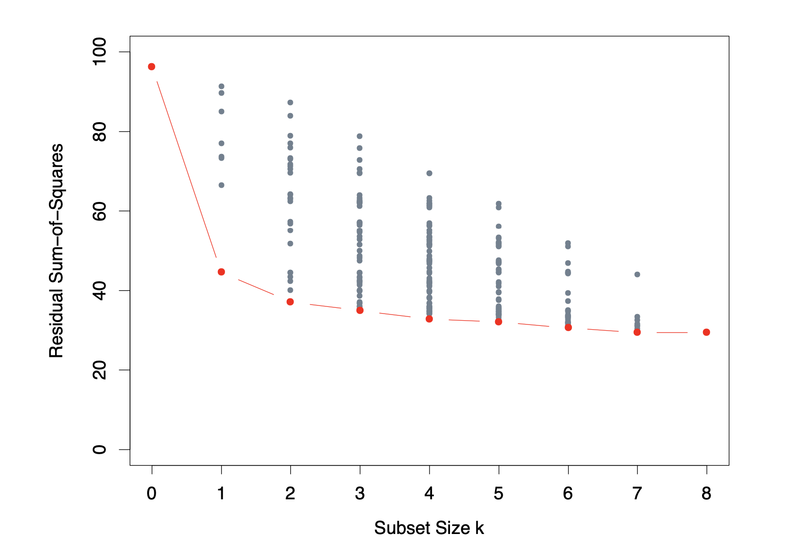

# Today's program


## Recap from past weeks

- `R` to import data and perform exploratory data analysis.
    - Summary statistics: *mean*, *median*, *variance*, *standard deviation*
    - Data visualization with `ggplot2`
    - Notions of correlation and causality

- Principal Component Analysis and clustering 
    - Theoretical principles
    - Practice with `FactoMineR`

--

## Today

Introduction to regression model: simple linear regression to Ordinary Least Squares estimation & logistic regression
  
 The program will be first to introduce the theory and applications in class (~1h) `r emo::ji("cap")` and then practice (~1h) `r emo::ji("worker")`.
 
---
# Why regression?

> Life is not always linear. So what is the interest of linear models in the area of fancier machine learning tools? `r emo::ji("thinking")`

--

There are several reasons to this:

--

- Historically very used, in particular in the precomputer age of statistics;

--

- Provide interpretable solution and still a good approximation of reality in many cases;

--

- Can sometimes outperform fancier non linear models, for example with low number of training;

--

- Many non-linear technics are the generalization of linear methods.

--

In fact, you can transform your variables, for example using non linear transformation ( $X^3$ ) or interactions between variables ( $X_1 . X_3$ ) and then apply a linear model to these variables. This is still valid with what we will see in this class.

`r emo::ji("warning")` Transformation such that $\beta_i e^{3X_{i}}$ are accepted one, but not $e^{\beta_i X_{i}}$. **The model has to be linear in the parameters $\beta_i$.**

---
# Example (1)

Remember the data set of the first class.

```{r,echo=FALSE, warning = FALSE, message=FALSE}
library(knitr)
ozone <- read.table("./ozone.txt", header=TRUE)
kable(ozone[1:6,1:10])
```

These data are real meteorological data taken at Rennes in 2001 in order to predict the maximum of ozone concentration in a day.
---
# Example (2)

Linearity in some natural phenomenon seems to be a good hypothesis!

```{r,echo=FALSE, warning = FALSE, message=FALSE}
pairs(ozone[, 1:4])
```


---
# Simple regression

**General goal** 

Explain a *continuous* variable $Y$ as a function of another variable $X$.

--

`r emo::ji("idea")` *Note that this is a general goal that goes beyond the regression class*

--

**Linear regression** 

Suppose that $Y$ and $X$ have the following relationship

$$Y=\beta_{0}+\beta_{1} X+\varepsilon$$

with $\varepsilon$ a noise ( $\mathbb{E}[\varepsilon] = 0$ and $\mathbb{V}[\varepsilon] = \sigma^2$)), and $\beta_0$ and $\beta_1$ unknown parameters.

--

`r emo::ji("up arrow")` $\varepsilon$ corresponds measure errors or forgotten predictors.

--

**Your goal** 

Once we admit the previous hypothesis, find estimation of the parameters $\beta_0$ and $\beta_1$ from a sample of data $(x_1, y_1), (x_2, y_2), \dots , (x_n, y_n)$. The estimations you find are denoted $\hat \beta_0$ and $\hat \beta_1$.

---
# Which line to choose?

Suppose we have some data, an average score in function of the class size.
We want to rely these two data with a regression line.
--


```{r, message = FALSE, echo = FALSE, warning = FALSE}
library(ggplot2)
library(haven) #rda
library(dplyr) # data wrangling
```

.left-wide[
```{r, echo=FALSE, fig.width = 8,fig.align='center',fig.height=4, message = FALSE}
grades = read_dta("./grade5.dta")
grades_avg_cs = grades %>%
  group_by(classize) %>%
  summarise(avgmath_cs = mean(avgmath),
            avgverb_cs = mean(avgverb))

g_math_cs = ggplot(grades_avg_cs, aes(x = classize, y = avgmath_cs)) + 
    geom_point(size = 2) +
    xlim(0,45) +
    labs(
      x = "Class size",
      y = "Average score",
      title = "Mathematics") +
    theme_bw(base_size = 20) +
    ylim(50, 80) +
    theme_bw(base_size = 14) +
  geom_hline(yintercept = 65, col = "#d90502")
g_math_cs
```
]

.right-thin[
A *line*! Great. But **which** line? This flat one?
]

---
# A another that looks better

Or this one? It seems better.


```{r,echo=FALSE,fig.align='center',fig.height=4,fig.width=7, message = FALSE}
g_math_cs +
  ylim(50, 80) +
  theme_bw(base_size = 14) +
  geom_abline(intercept = 55,slope = 0.6, col = "#d90502")
```


--

We need a rule to decide! Any idea?


---
# Proceadure to find $\hat \beta_0$ and $\hat \beta_1$


With your hypothesis on the data relationship and your sample of data, you can write $n$ equations:

--

$$y_i =  \beta_0 + \beta_1 x_i + \varepsilon_i$$

--

The goal is to find $\hat \beta_0$ and $\hat \beta_1$ such that:

$$\hat y_i =  \hat \beta_0 + \hat \beta_1 x_i \sim y_i $$
Meaning that our prediction $\hat y_i$ is close to the true value $y_i$.

(`r emo::ji("idea")` *Note the hat on notation. It means that $\hat y_i$  is our prediction for $y_i$*)

--

Then you need to define what "close to" means. What would you suggest?

--

Usually the square difference is the most used. Meaning that we consider $\hat y_i$ close to $y_i$ if $(\hat y_i - y_i)^2$ is small.

---
# Graphical vizualization

```{r,echo=FALSE,fig.align='center',fig.height=4,fig.width=7, warning = FALSE, message = FALSE}
grades_avg_cs = grades %>%
  group_by(classize) %>%
  summarise(avgmath_cs = mean(avgmath),
            avgverb_cs = mean(avgverb))

math_class_reg <- lm(avgmath_cs ~ classize, data = grades_avg_cs)
math_class_reg <- broom::augment(math_class_reg)

g_math_cs = ggplot(grades_avg_cs, aes(x = classize, y = avgmath_cs)) + 
    geom_point(size = 2) +
    xlim(0,45) +
    labs(
      x = "Class size",
      y = "Average score",
      title = "Mathematics") +
    theme_bw(base_size = 20) +
    ylim(50, 80) +
    theme_bw(base_size = 14)
g_math_cs +
    ylim(50, 80) +
    theme_bw(base_size = 14) +
  stat_smooth(method = "lm", se = FALSE, colour = "#d90502") +
  annotate("text", x = 6.5, y = 64, label = "hat(y)", parse = TRUE, colour = "#d90502", size = 6) +
  geom_segment(data = math_class_reg,
               aes(xend = classize, yend = .fitted), color = "#d90502", size = 0.5) +
    geom_rect(data = math_class_reg,
              aes(
              xmin = classize,
              xmax = classize + abs(.resid)*0.65,
              ymin = avgmath_cs,
              ymax = avgmath_cs - .resid),
              fill = "darkgreen",
              alpha = 0.3) +
  coord_fixed(ratio = 0.65)
```


--

> Bonus question: could we have chosen something else than the minimization of the squares? `r emo::ji("detective")`


---

# Back to the proceadure

With a mathematical notation it means that $\hat \beta_{0}$ and $\hat \beta_{1}$ are solutions of:

$$\min _{\beta_{0}, \beta_{1}} \sum_{i=1}^{n}\left(y_{i}-\beta_{0}-\beta_{1} x_{i}\right)^{2}$$
-- 

Once you minimized this quantity, you still have a gap in between the prediction and the true labels. To investigate this you can look at what is called the residuals:

$$\hat{\varepsilon}_{i}=y_{i}-\hat{y}_{i}$$
--

Having solved this quantity allows to do **predictions**, so that for any new $x_j$ for which you don't know the $y_j$:
$$\hat{y}_{j}=\hat{\beta}_{0}+\hat{\beta}_{1} x_{j}$$
---
# A note on $R^2$

In linear regression we usually see a $R^2$ reported. What does it mean?


--

$$\mathrm{R}^{2}=\frac{\|\hat{Y} - \bar{Y}\|^{2}}{\|Y - \bar{Y}\|^{2}}=\cos ^{2} \theta_{0}$$

with $\hat{Y}$ the prediction, and $Y$ the *truth*. 
*"Which part of the $Y$ can be explained with the linear model?"*

--

```{r, echo=FALSE, out.width="50%", fig.cap="Matzner, Régression avec R", fig.align = 'center'}
knitr::include_graphics("./img/R2.png")
```

--

Be careful: the more you add variables to your model, the more the $\mathrm{R}^{2}$ will be small. Therefore it is a not a good quantity to compare regressions with a different number of variables.

---
# Back to ozone data set

Remember in class 1 we worked in a data set called `ozone`, and will focus on `maxO3` (concentration en ozone (en $\mu g / m^3$) ) and `T12` the temperature at 12pm. 

--

We recall how to plot data using `ggplot`:

```{r, message = FALSE, fig.width=7, fig.height = 3.5, fig.align="center"}
ozone <- read.table("./ozone.txt", header=TRUE)
ggplot(ozone, aes(x = T12, y = maxO3)) +
  geom_point() +
  theme_bw() 
```

Does the linear assumption seems to be a good one?
---
# Estimate $\hat \beta_0$ and $\hat \beta_1$ 

In `R` the common function to perform a simple linear model is `lm()`.

```{r, message = FALSE}
reg.result <- lm(maxO3~T12, data = ozone)
reg.result
```
--

**Typical questions you should answer:**

- Where can we read $\hat \beta_0$ and $\hat \beta_1$?

- Is this result statistically significant?

- What is the $R^2$? What is the signification of this quantity?

--

**Tips:** You can simply take the coefficients by doing: `reg.result$coef`


---
# Look at the results in detail 

```{r}
summary(reg.result)
```


---
# Vizualisation of the result

```{r, fig.width=7, fig.height = 3.5, fig.align="center"}
ggplot(ozone, aes(x = T12, y = maxO3)) +
  geom_point() + 
  geom_abline(intercept = reg.result$coefficients[[1]], slope = reg.result$coefficients[[2]], color="red", linetype="dashed", size=1) +
  theme_bw()
```

Tips: 
- You can have further details on the regression doing `plot(reg.result)`.
- You can produce the same plot using `geom_smooth` and the `method = "lm"`.
directly in `ggplot()`

---
# Prediction

Imagine you have a new value for `T12`, could you predict a value for `maxO3`?

--


```{r}
xnew <- 19
xnew <- as.data.frame(xnew)
colnames(xnew) <- "T12"
predict(reg.result, xnew, interval="pred") # xnew has to be a dataframe with same variable, here "T12"
```


Don't forget to produce the associate confidence interval!

---
# Multiple regression


**General goal** 

Explain a *continuous* variable $Y$ as a function of other variables $X_1$, $X_2$, $X_3$, ..., $X_p$.

--

`r emo::ji("idea")` *This is a generalization of our previous problem.*

--

**Multiple linear regression** 

This time we suppose the following relationship for the observed data:

$$y_{i}=\beta_{0}+\beta_{1} x_{i 1}+\beta_{2} x_{i 2}+\cdots+\beta_{p} x_{i p}+\varepsilon_{i}, \quad i=1, \cdots, n$$

with $\varepsilon$ a noise, $\mathbb{E}[\varepsilon]=0$ and $\mathbb{V}[\varepsilon] = \sigma^2$, and $\beta_0$, ...,  $\beta_p$ unknown parameters.


---
# Equivalence with matrix

Instead of $n$ equations, you can write everything in a matrix with $n$ rows, and $p$ column:


$$Y_{n \times 1}=X_{n \times(p+1)} \beta_{(p+1) \times 1}+\varepsilon_{n \times 1}$$


with $\mathbb{E}(\varepsilon_{n \times 1})=0, \quad \mathbb{V}(\varepsilon_{n \times 1})=\sigma^{2} I$

`r emo::ji("idea")` *Matrix size are indicated. Make sure you can understand this as equivalent with the previous formulation.*

--


$\left[\begin{array}{c}Y_{1} \\ \vdots \\ Y_{i} \\ \vdots \\ Y_{n}\end{array}\right]=\left[\begin{array}{cccccc}1 & x_{11} & \cdots & x_{1 j} & \cdots & x_{1 p} \\ \vdots & \vdots & & \vdots & & \vdots \\ 1 & x_{i 1} & & x_{i j} & & x_{i p} \\ \vdots & \vdots & & \vdots & & \vdots \\ 1 & x_{n 1} & \cdots & x_{n j} & \cdots & x_{n p}\end{array}\right]\left[\begin{array}{c}\beta_{0} \\ \beta_{1} \\ \vdots \\ \beta_{j} \\ \vdots \\ \beta_{n}\end{array}\right]+\left[\begin{array}{c}\varepsilon_{1} \\ \vdots \\ \varepsilon_{i} \\ \vdots \\ \varepsilon_{n}\end{array}\right]$

---
# Estimation

Solve this: 

$$\hat{\beta}=\underset{\beta_{0}, \cdots, \beta_{p}}{\operatorname{argmin}} \sum_{i=1}^{n}\left(y_{i}-\beta_{0}-\sum_{j=1}^{p} \beta_{j} x_{i j}\right)^{2}$$
`r emo::ji("idea")` *I assure you it is the same problem as before, minimizing a sum of $n$ squared components. The $\beta_1$ is now composed of several terms.*

--

Once you have found parameters $\hat \beta_0$, ...,  $\hat \beta_p$, you can predict $\hat y$ from any new $x_{\text{new}}$:

$$\hat{y}=\hat{\beta}_{0}+\hat{\beta}_{1} x_{\text{new}, 1}+\cdots+\hat{\beta}_{p} x_{\text{new}, p}$$

--

The residuals (difference between *true* values and predictions) are the same as before:

$$\hat{\varepsilon}_{i}=y_{i}-\hat{y}_{i}$$

---
# A little more challenging slide

When minimizing the least squares to find $\hat \beta$, the idea is to compute the derivative of the sum of squares with respect to $\beta$.

$$0=\frac{\partial\|Y-X \beta\|^{2}}{\partial \beta}=\frac{\partial(Y-X \beta)^{\prime}(Y-X \beta)}{\partial \beta}$$
At the end (using derivative formula for matrix):

$$\hat{\beta}=\left(X^{\prime} X\right)^{-1} X^{\prime} Y$$ if $X^{\prime} X$ is inversible.


**Properties of $\hat \beta$**

$\mathbb{E}(\hat{\beta})=\beta ; \mathbb{V}(\hat{\beta})=\left(X^{\prime} X\right)^{-1} \sigma^{2} ; \mathbb{V}\left(\hat{\beta}_{j}\right)=\left[\left(X^{\prime} X\right)^{-1}\right]_{j j} \sigma^{2}$

--

Don't worry if you don't understand everything. Focus on properties: unbiased estimator (good!)

---
# Visualization

```{r, echo=FALSE, out.width="50%", fig.cap="Credits: The Elem. of Stat. Learning. p.45", fig.align = 'center'}
knitr::include_graphics("./img/RSS3d.png")
```

A 3D visualization is still possible, it is exactly the same problem as before.

---
# Explain maxO3 with other variables?

Here we propose to explain `maxO3` with quantitative variables.

```{r}
ozone.m <- ozone[,1:11] # subset of quantitative variables
reg.multiple <- lm(maxO3~., data = ozone.m) # multiple regression
reg.multiple
```

---
# Summary

How to read the summary?
```
Coefficients:
            Estimate Std. Error t value Pr(>|t|)    
(Intercept) 12.24442   13.47190   0.909   0.3656    
T9          -0.01901    1.12515  -0.017   0.9866    
T12          2.22115    1.43294   1.550   0.1243    
T15          0.55853    1.14464   0.488   0.6266    
Ne9         -2.18909    0.93824  -2.333   0.0216 *  
[...]   
maxO3v       0.35198    0.06289   5.597 1.88e-07 ***


Signif. codes:  0 ‘***’ 0.001 ‘**’ 0.01 ‘*’ 0.05 ‘.’ 0.1 ‘ ’ 1

Residual standard error: 14.36 on 101 degrees of freedom
Multiple R-squared:  0.7638,	Adjusted R-squared:  0.7405 
F-statistic: 32.67 on 10 and 101 DF,  p-value: < 2.2e-16
```

---
# Subset selection

Two reasons for which you may not be satisfied with the current least squares regression:

- *Prediction accuracy* with low bias but high variance as the number of variables increases

- *Poor interpretation* if too many variables.

--

An illustration with a data set on prostate cancer:

```{r, echo=FALSE, out.width="50%", fig.cap="Credits: The Elem. of Stat. Learning. p.58", fig.align = 'center'}

```

---
# Methods to select a subset of variables

But with many variables it can be complicated to test all the combinations (typically above $> 40$).

--

- Forward-stepwise selection:

Start with one variable and add variables one by one.

- Backward-stepwise selection

Reverse approach starting with all the variables and getting rid of the ones that explain the less.

And others modulations of these two.

--

>You can also find continuous methods that act on the $\beta$ rather than proceeding with selecting variables. For that you introduce a penalty on the optimization step to shrink high values for $\beta$. The higher the penalty, the lower the coefficients (as if you drop variables). These methods belongs to the Lasso or Ridge methods.

---
# How to proceed in practice?

For sure: not manually! 
--
You have to automatize this step and find a criteria. We propose to use the `regsubsets` function.

```{r,  fig.width=6, fig.height = 4, fig.align="center"}
library(leaps)
choice <- regsubsets(maxO3~.,data=ozone.m,nbest=1,nvmax=11)
plot(choice, scale="bic")
```

You can launch the final regression with `reg.final <- lm(maxO3~T12+Ne9+Vx9+maxO3v, data= ozone.m)`.

--
You can also use `RegBest` in `FactoMineR` to select the model that uses $R^2$ on groups with same number of variables.

---
# Qualitative or categorical variable

Remember that in the first session we have seen different two different data types: qualitative and quantitative. For example a person has `brown` or `blue` eyes, or the school is in the `center` of the city or in the `suburb`.

--
For example we can consider this simple toy data set:


```{r}
df1 = data.frame(income=c(3000, 5000, 7500, 3500),
             sex=c("male","female","male","female"))
```

Usually the trick is to transform this in a dummy variable ( $1$ or $0$ ). 
`r emo::ji("warning")` `R` does this automatically, you don't have to do it manually.

```{r, echo = FALSE}
df1$sex <- ifelse(df1$sex == "female", 1, 0)
```


```{r}
lm1 = lm(income ~ sex, df1)
lm1
```

---
# Interpretation

The intercept $\beta_1$ measures the difference in intercept from being a female.

```{r, echo = FALSE, message = FALSE, fig.width=6, fig.height = 5, fig.align="center"}
a <- coef(lm1)[1]
b <- coef(lm1)[2]
x = df1$sex
y = df1$income
dta = df1

# plot
expr <- function(x) a + b*x
errors <- (a + b*x) - y

plot(x,y, type = "p",pch = 21, col = "blue", bg = "royalblue",frame.plot = TRUE,cex=1.2,xlim=c(-.2, 1.7), ylim = c(min(y)-.1, max(y)+.1),xlab="sex",ylab="income",xaxt="n")
axis(side = 1,c(0,1))

points(0, mean(dta[dta$sex == 0, "income"]), col = 'orange',
       cex = 3, pch = 15)
text(0.35, mean(dta[dta$sex == 0, "income"]), "E[Y | sex = 0]", pos = 3)

points(1, mean(dta[dta$sex == 1, "income"]), col = 'orange',
       cex = 3, pch = 15)
text(0.95, mean(dta[dta$sex == 1, "income"]), "E[Y | sex = 1]", pos = 2)
curve(expr = expr, from = min(x)-1, to = max(x)+1, add = TRUE, col = "black")
segments(x0 = x, y0 = y, x1 = x, y1 = (y + errors), col = "green",xaxt="n",yaxt="n")

# red arrow for effect size at xx=1.3
xx = 1.3
arrows(x0 =xx, y0 = mean(dta[dta$sex == 0, "income"]), x1 = xx, y1 = mean(dta[dta$sex == 1, "income"]),col="red",lw=3,code=3,length=0.1)
# dashes
segments(x0=0,y0 = mean(dta[dta$sex == 0, "income"]),x1=xx,y1 = mean(dta[dta$sex == 0, "income"]),col="red",lty="dashed")
segments(x0=1,y0 = mean(dta[dta$sex == 1, "income"]),x1=xx,y1 = mean(dta[dta$sex == 1, "income"]),col="red",lty="dashed")

text(xx, mean(y)+100, paste("b1 =",round(b,2)), pos = 4,col="red")
abline(a=mean(dta$income),b=0,col="blue",lw=2)
```
--
Remember that using `lm()` with a qualitative variable is like doing a ANOVA or ANCOVA. See "Régression with R" to learn more.


Crédits to Prof. Florian Oswald for this schematic.

---
# And if $Y$ is not continuous?

For example with a binary $Y$?

--

We take here the example of age and the presence or the absence of Coronary Heart Disease (CHD).

```{r, echo = FALSE}
CHD <- read.table('./CHD.txt', header = TRUE)
head(CHD)
```

**Goal** Predict CHD from the age.

--

```{r, echo = FALSE, message = FALSE, fig.width=7, fig.height = 2, fig.align="center"}
ggplot(CHD, aes(x = AGE, y = CHD)) +
  geom_jitter(alpha = .5, width = 0, height = .1) +
  geom_smooth(method = "lm") +
  theme_bw()
```

First attempt: a linear model. Does it seem to be a good idea?

---
# Binned data

We can estimate proportion of CHD in each age categories.

```{r, echo = FALSE, message = FALSE}
xs=quantile(CHD$AGE, c(0, 0.1, 0.2, 0.3, 0.4, 0.5, 0.6, 0.7, 0.8, 0.9, 1))
binned_CHD <- CHD %>% 
  mutate(AGE_binned = cut(AGE, breaks=xs, include.lowest=TRUE)) %>%
  group_by(AGE_binned) %>%
  summarise(nb_CHD = sum(CHD), total = n())

binned_CHD$prop <- round(binned_CHD$nb_CHD/binned_CHD$total,2)*100

knitr::kable(binned_CHD)
```

---
# Visualization

```{r, echo = FALSE, message = FALSE, fig.width=7, fig.height = 2, fig.align="center"}
ggplot(CHD, aes(x = AGE, y = CHD)) +
  geom_jitter(alpha = .5, width = 0, height = .1) +
  geom_smooth(method = "glm", 
    method.args = list(family = "binomial")) +
  theme_bw()
```
---
# Toward the formula

Mathematically it writes:

$$\mathbb{P}({\text{CHD}=1|\text{AGE}}) =
\frac{e^{\text{(intercept)} + \beta \text{AGE}}}{1 + e^{\text{(intercept)} + \beta \text{AGE}}}$$

Or equivalently:

$$\log \Bigg( \frac{\mathbb{P}({\text{CHD}=1|\text{AGE})}}{\mathbb{P}({\text{CHD}=0|\text{AGE}})} \Bigg)   = \underbrace{\text{(intercept)} + \beta \times  \text{AGE}}_{Linear}$$

--
How to run in `R` ?
```{r, }
model <- glm(CHD ~ AGE, family = binomial(link="logit"), data = CHD)
model$coefficients
```
--
$$\log \left(\frac{\mathbb{P}(\mathrm{CHD}=1 \mid \mathrm{AGE})}{\mathbb{P}(\mathrm{CHD}=0 \mid \mathrm{AGE})}\right)=-5.31+0.11 \times \mathrm{AGE}$$
---
# Logistic regression: summary

**Data**

$n$ observations $(x_i, y_i)$ where $x_{i} \in \mathbb{R}^{p}$ and $y_{i} \in\{0,1\}$.

--

**Logistic regression**

$$\log \left(\frac{\mathbb{P}(Y=1 \mid X_1, \dots X_p)}{\mathbb{P}(Y=0 \mid  X_1, \dots X_p)}\right)=\beta_0+\beta_1 X_1 + \dots + \beta_p X_p$$
--

**General remarks**

- You can have a multiclass problem (meaning $Y$ can be qualitative with several labels).

- The `glm` function contains everything you should need.

---
# General conclusion


All these models are used a lot!

- `ozone` data is a real data used in meteorology set that is mostly analyzed with linear regression. `AirParis` and `airBreizh` (and probably others) are based on linear models;

- In general econometrics uses a lot linear regression;

- The medical domain highly uses logistic regression, such as the medical domain, but also for spam or fraud detection in companies.


For the lab we will work with stock values and predict if the market is going up or down.
 
---
# Credits for this class

`r emo::ji("thanks")` 

To professors and people sharing their class. Most of the content here comes from:

- François Husson's book *R pour la statistique et la science des données* (in particular the `ozone` data analysis);

- Florian Oswald for his econometrics class at SciencePo `ScPoEconometrics`.

- Imke Mayer and Erwan Scornet for sharing to me their slides and lab;

- Trevor Hastie and Robert Tishirani's book (*The Elements of Statistical Learning*) and youtube series.

--

If you want to dig into the theory you can read the book *Régression avec R* from Eric Matzner-Lober and Pierre-André Cornillon. 

You can also watch the Youtube series of Trevor Hastie and Robert Tishirani.


 
