# Outline

## Purpose of this class

- Give you an insight of a causal (or non-causal) interpretation of data;

- Ideas for practical approach.

## Ressources


**Books**
- *Mostly Harmless Econometrics*, Joshua Angrist, 2008
- *The Book of Why, Judea Pearl*, Judea Pearl, Dana Mackenzie, 2018

**Talks**
- One of Esther Duflo's talks
- Jonas Peter's class on Youtube
- *A Crash Course in Causality* on Coursera

---
# Correlation is not Causation (1)


First, because it can be spurious,

```{r, echo=FALSE, out.width="70%", fig.cap="", fig.align= "center"}
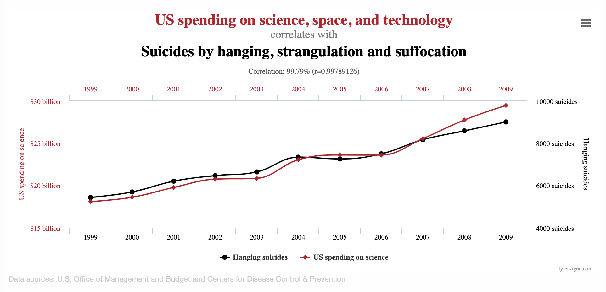
```


---
# Correlation is not Causation (2)

Second, because correlation can just reflect an association,

```{r, echo=FALSE, out.width="50%", fig.cap="", fig.align= "center"}
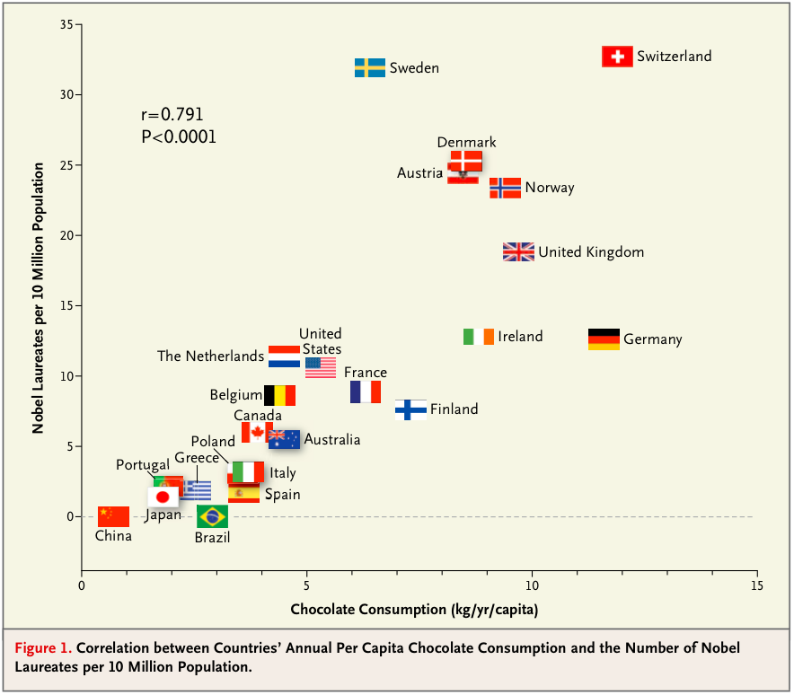
```
<sub> Source: Figure published in Messerli (2012) Chocolate Consumption, Cognitive Function, and Nobel Laureates, New England Journal of Medicine </sub>


---

# Causality

A word we all know,

>*As a human being, you are already innately familiar with causal inference’s fundamental concepts. Through sheer existence, you know what a causal effect is, understand the difference between association and causation, and you have used this knowledge consistently throughout your life.*

> Miguel Hernan, Causal inference, What if?

--

Is the answer in data?

>*“[...] falsely believing that the answers to all scientific questions reside in the data, to be unveiled through clever data-mining tricks. Much of this data-centric history still haunts us today. We live in an era that presumes Big Data to be the solution to all our problems. Courses in “data science” are proliferating in our universities, and jobs for “data scientists” are lucrative in the companies that participate in the “data economy.” But I hope with this book to convince you that data are profoundly dumb.”*

> Judea Pearl, The Book of Why: The New Science of Cause and Effect


---
# Why do we care?

Many of the *questions* you might encounter are causal.

--

- *Social sciences*: Why do people behave in the way they do?
- *Health sciences*: Why do people get sick? Which medicine can cure them?

--

Which is **totally different** as:

- *Social sciences*: Can I predict the behavior of this individual?
- *Health sciences*: Can I predict the probability of this individual to get Alzheimer with the genotype?
--

> `r emo::ji("books")` The second type of question is prediction (i.e, Machine Learning).

--

To convince yourself, remember the linear regression class. 

- The model could predict $Y$ with $X$...

- ..but it was hard to interpret coefficients, 


- ..and even harder to go from variable importance to causality!


---
# Machine Learning VS Causal inference


Most *Artificial Intelligence* tasks only care about **prediction**

*Example*: predicting whether a photo is of a dog or a cat is vital to how Google Images works, but it doesn't care what element in a photo of a dog or a cat makes it unambiguously recognizable as being a dog or a cat
 
--

Let's take the rooster example:

```{r, echo=FALSE, out.width="50%", fig.cap="", fig.align= "center"}

```

<sub>Source: J. Pearl, and for image https://www.trialrun.us/</sub>

--

**Causal inference**: We want to predict what would happen if we change
the system.

*What would happen if I give a somnifer to the rooster?*

---
# Examples of causal questions

-  Is there an effect of financial incentives on teacher performance (measured both directly by teacher absences and indirectly by educational output measures, such as average class test scores)? (Esther Duflo's work)

- How does the type of school affect a child's later achievements?

- Do the students succeed because of the new teacher? 
Had the students remained with the old teacher, wouldn't they have
succeeded

- Effect of reducing car traffic on air pollution 

- Do job training programs raise average future income?

- Is there an effect of social pressure on voter participation?  Neighbors mailing:  the recent voting record of everyone on their households would be sent to all their neighbors.

- What is the effect of hydroxychloroquine on mortality?

---
# Concept of causality


__Causality__: what are we talking about? 

- We say that `X` *causes* `Y`

  - if we were to intervene and *change* the value of `X` ***without changing anything else***...
  - then `Y` would also change ***as a result***.
  
> Example `X = sunshine` and `Y = a singing rooster`.

`r emo::ji("warning")` It does **NOT** mean that `X` is the only factor that causes `Y`.  
--

--

.pull-left[
Some people wants to look what causes what (which `X` causes `Y`).

```{r, echo = FALSE, out.width="20%", fig.cap="J. Pearl", fig.align= "center"}

```

]

--

.pull-right[

Other people wants to measure the impact of `X` on `Y`. 

```{r, echo = FALSE, out.width="30%", fig.cap="D. Rubin", fig.align= "center"}
knitr::include_graphics("./img/rubin.jpeg")
```

]

---
# Lung cancer (1)

Does smoking cause lung cancer?

```{r, echo = FALSE, out.width="70%", fig.cap="", fig.align= "center"}
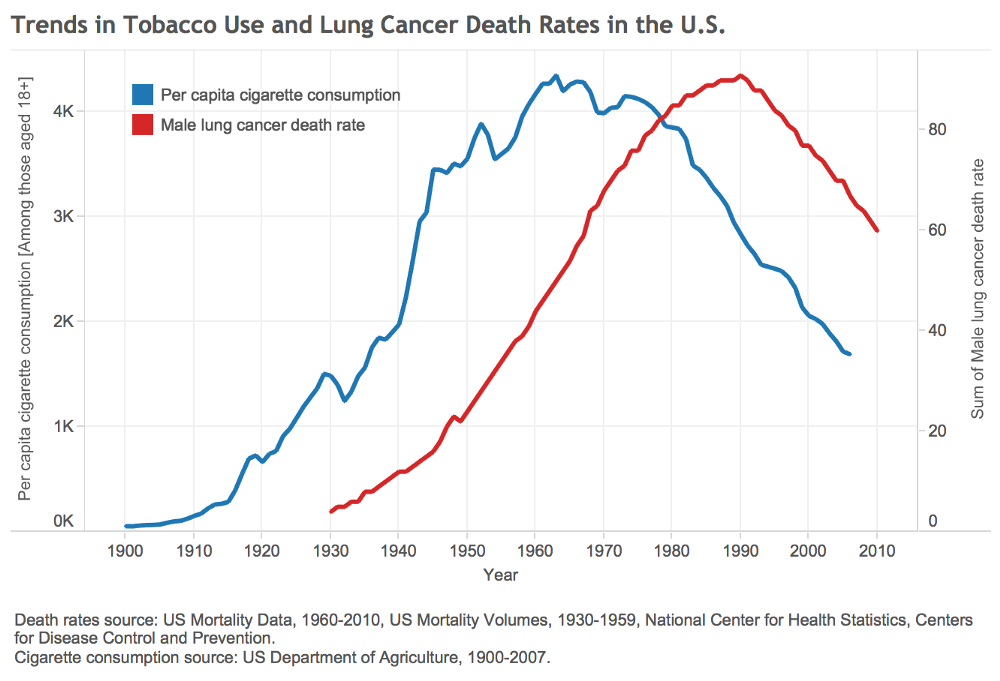
```
<sub>Credits: cancer.org and [rapidshift](http://www.rapidshift.net/how-scientific-causation-came-to-be-solidified-in-the-tobacco-use-vs-lung-cancer-death-rates-era-relevance-to-climate-skeptics-now/)</sub>

---
# Lung cancer (2)

Today the answer seems obvious, but back to the 1950's it was a debate with a big increase in deaths which is happening after a fast growth in cigarette consumption.

--
 But at the time:
 - Other possible causes, such as general greater air pollution;
 - And smokers were not randomly selected, but had a certain typical age, education, income, etc.
 
 How can we conclude?
 
--

`r emo::ji("bulb")` Note that in the current media similar debats exist, for example with bees and neonicotinoids, polyphenol a and hormones, round-up, others.

---
#  Class size

Another example is class size and student's achievement. What would you do or not do with such data?

.pull-left[
```{r, echo=FALSE, out.width="60%", fig.cap="DEPP", fig.align="center"}
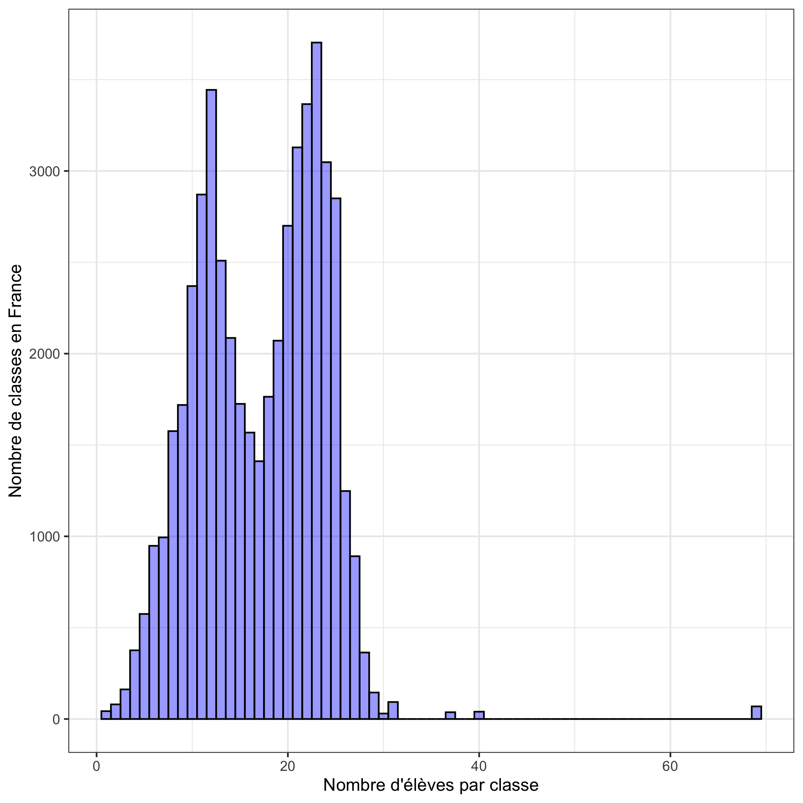
```

]

--
.pull-right[

```{r, echo=FALSE, out.width="100%", fig.cap="DEPP", fig.align="center"}
knitr::include_graphics("./img/histogram_class_size_with_categ.png")
```
]
 


---
# Randomized Experiments

- Often called **R**andomized **C**ontrolled **T**rials (RCT).

- The first RCTs were conducted a long time ago (18th and 19th century), mainly in **Medecine**. 

- In the beginning of the 20th century they were popularized by famous statisticians like **J. Neyman** or **R.A. Fisher**. 

- Since then they have had a growing influence. 

- As for economics, the **2019 Nobel Price in Economics** was awarded to three exponents of RCTs, [Abhijit Banerjee, Esther Duflo and Michael Kremer](https://www.economist.com/finance-and-economics/2019/10/17/a-nobel-economics-prize-goes-to-pioneers-in-understanding-poverty), "for their experimental approach to alleviating global poverty".

---
# Potential outcome framework

Treatment $W$, $X$ covariates, $Y$ the outcome, so that:

$\left(X_{i}, W_{i}, Y_{i}(1), Y_{i}(0)\right) \in \mathcal{X} \times\{0,1\} \times \mathbb{R} \times \mathbb{R}$

--

`r emo::ji("face_with_raised_eyebrow")` If I want to know the effet of $W$ on the subect $i$, what is this quantity?

--

$$\Delta_i \triangleq Y_i(1) - Y_i(0)$$
--

Sadly, we have a missing problem: $\Delta_i$ never observed (only observe one outcome/indiv) `r emo::ji("sweat_smile")`

--

```{r, echo=FALSE, out.width="70%", fig.cap="Typical data", fig.align="center"}
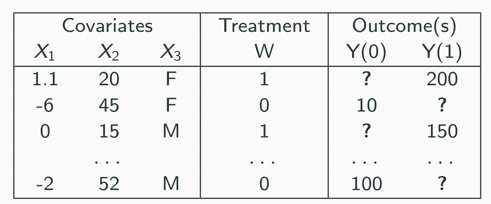
```

---
# Target quantity

Rather that the individual effect, another quantity of interest is the average treatment effect, the average difference of the potential outcomes over the **entire** population.

```{r, echo=FALSE, out.width="40%", fig.cap="A counterfactual world", fig.align="center"}
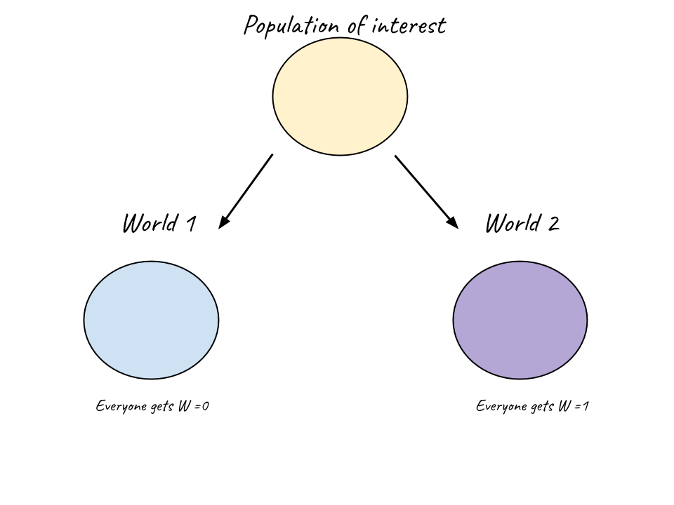
```

--

$$\tau = \mathbb{E}[Y(1) - Y(0)] = \mathbb{E}[Y(1)] - \mathbb{E}[Y(0)]$$


> In general $\mathbb{E}[Y(1) - Y(0)]  \neq \mathbb{E}[Y | W=1] - \mathbb{E}[Y | W=0]$, except in RCT

---
# RCT: the ideal case

Within the RCT, we have:
$$\mathbb{E}[Y(1) - Y(0)]  = \mathbb{E}[Y | W=1] - \mathbb{E}[Y | W=0]$$

$\Rightarrow$ Although $\Delta_i$ never observed, $\tau$ is identifiable and  can be estimated 


--
```{r, echo=FALSE, out.width="100%", fig.cap="", fig.align="center"}
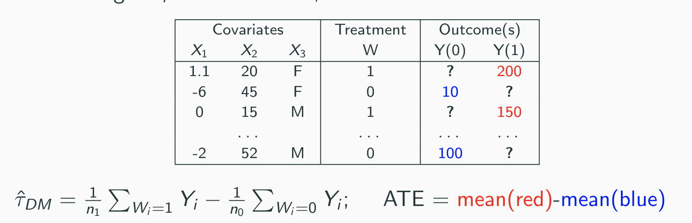
```

---
# And for other data?

Usually, $\mathbb{E}[Y(1) - Y(0)]  \neq \mathbb{E}[Y | W=1] - \mathbb{E}[Y | W=0]$. What can we do?

> `r emo::ji("books")` Note that other type of data are called observational data, or real world data. In fact, these are the most common data.

--

Usually data are confounded, that is a third variable is related to both the exposure of interest `W` and the response `Y` 

Examples:

- being in a small class at kindergarten and being in REP's school, 
- or if giving HCQ mostly to younger patient.

--

Ideally we would like to "gather" all these variables, match them, and emulate something that looks like a RCT, because a RCT is comfortable `r emo::ji("relieved")`.

--

Mathematically, we want a conditional independence

$$\left\{Y_{i}(0), Y_{i}(1)\right\} \perp  W_{i} \mid X_{i}$$
> `r emo::ji("nerd")` This is called the unconfoundedness assumption, but don't worry if you do not precisely understand the mathematic notation.

---
# Example

Note that this is why in RCT you will often find a so called **Table 1** to show that the covariate balancing is good, so that randomization is achieved.


```{r, echo=FALSE, out.width="100%", fig.cap="", fig.align="center"}
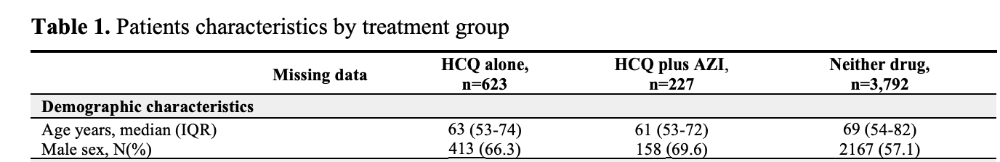
```


---
# In practice

There are several solutions, and will only consider two of them.

> `r emo::ji("thinking")` Before, have you any intuitive suggestion?

--

- The most intuitive one: **Matching**

> Pair each treated (resp. untreated) observations with one or more similar untreated (resp. treated) patient

--

- A less intuitive one, but easier in practice: **Weighting**, also called the inverse-propensity weighting (IPW)

> Weigthing groups so that control look like treated, meaning that they have the same distribution

---
# Matching (1)


```{r, echo=FALSE, out.width="80%", fig.cap="", fig.align="center"}
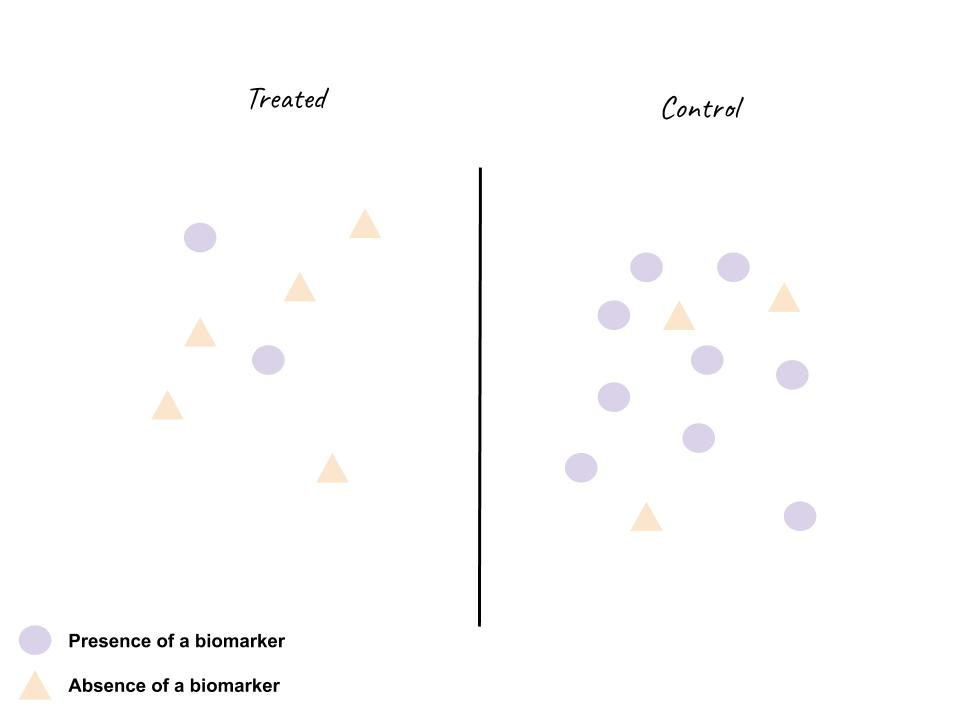
```
<sub>Examples from *Crash course of causal inference*, Coursera</sub>
---
# Matching (2)


```{r, echo=FALSE, out.width="80%", fig.cap="", fig.align="center"}
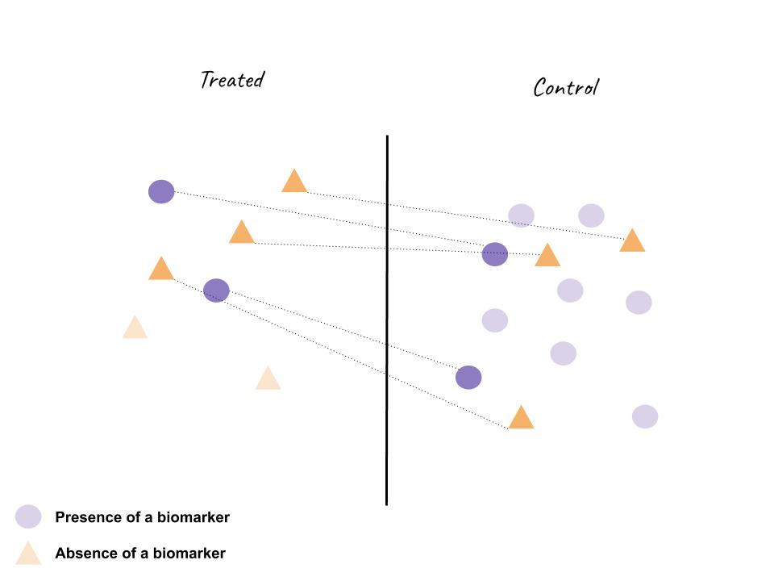
```
<sub>Examples from *Crash course of causal inference*, Coursera</sub>

---
# IPW


```{r, echo=FALSE, out.width="80%", fig.cap="", fig.align="center"}
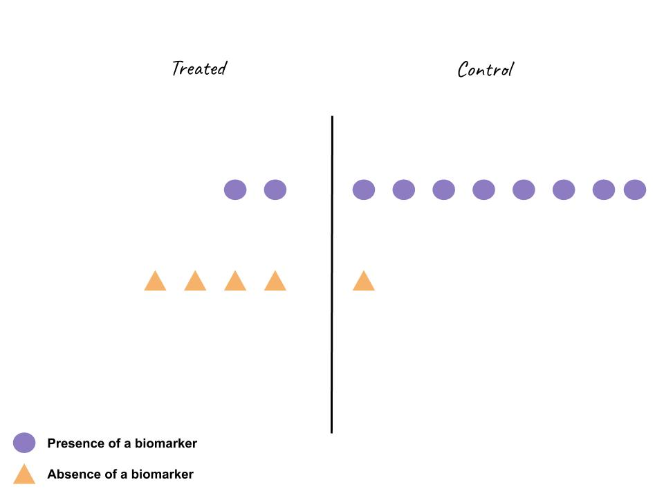
```
<sub>Examples from *Crash course of causal inference*, Coursera</sub>
---
# IPW: implementation


```{r}
# p are the propensity scores
ipw <- function(dataset, p) {
  W <- dataset$W
  Y <- dataset$Y
  G <- ((W - p) * Y) / (p * (1 - p))
  tau.hat <- mean(G)
  se.hat <- sqrt(var(G) / (length(G) - 1))
  c(ATE=tau.hat, lower_ci = tau.hat - 1.96 * se.hat, upper_ci = tau.hat + 1.96 * se.hat)
}
```


---
# Practical session on your data

Remember, you are asked to think about the gender and salaries in your data.

```{r, echo = FALSE, message = FALSE}
library(stringr)
salaries <- read.csv("./train_data.csv")
# remove useless spaces in the sex names
salaries$SEX <- str_replace_all(salaries$SEX, '\\s+', "")
```


gender | Mean of ANNUAL column (in k) | 
--------|:---------:
Female | `r round(mean(salaries[salaries$SEX == "FEMALE", "ANNUAL"])/1000, 2)` |
Male |`r round(mean(salaries[salaries$SEX == "MALE", 'ANNUAL'])/1000, 2)` | 


```{r, message=FALSE}
t.test(salaries[salaries$SEX == "FEMALE", "ANNUAL"], salaries[salaries$SEX == "MALE", "ANNUAL"])
```

---
# An example

Let's take a subgroup with a majority of women, such that `JC.TITLE == FAMILY & PROTECT SCVS SUPR II`

```{r, echo = FALSE, message= FALSE}
test <- salaries[salaries$JC.TITLE == "FAMILY & PROTECT SCVS SUPR II                     ",]
```

gender | Mean of ANNUAL column (in k) | 
--------|:---------:
Female | `r round(mean(test[test$SEX == "FEMALE", "ANNUAL"])/1000, 3)` |
Male |`r round(mean(test[test$SEX == "MALE", 'ANNUAL'])/1000, 3)` | 

In this subgroup, the difference in means is 1904 (CI:617 3192) where women are more paid.

--

This is not a so easy problem `r emo::ji("exploding head")`

What do you propose?

---
# Matching (1)

```{r}
library(MatchIt)
m.out <- matchit(SEX ~ RACE+EMPTYPE+NAME+JC.TITLE, method = "exact", data = salaries)
salaries.matched <- match.data(m.out)

# # you can check that each subgroup is the same respectively to the covariates chosen to match 
engineer <- salaries.matched[salaries.matched$subclass == 10,]
```
---
# Matching (2)

```{r, echo = FALSE, warning = FALSE, message=FALSE}
library(dplyr)
```


```{r}
dim(salaries.matched)
# salaries.matched %>%
#   group_by(SEX) %>%
#   select(one_of(covariates_to_keep)) %>%
#   summarise_all(funs(mean))
```

---
# Matching (3)

Estimating effects and standard errors for continuous outcomes after full matching involves including the matching weights in the outcome model with a proper error evaluation.

```{r, echo = FALSE, message = FALSE, warning=FALSE}
library('lmtest')
library('sandwich')
```


```{r}
fit1 <- lm(ANNUAL ~ SEX, data = salaries.matched, weights = weights)
coeftest(fit1, vcov. = vcovCL, cluster = ~subclass)
```

---
```{r, echo = FALSE}
# library(grf)
# salaries_encoded <- salaries
# salaries_encoded$EMPTYPE <- as.numeric(factor(salaries_encoded$EMPTYPE))
# salaries_encoded$NAME <- as.numeric(factor(salaries_encoded$NAME))
# salaries_encoded$RACE <- as.numeric(factor(salaries_encoded$RACE))
# salaries_encoded$SEX <- ifelse(salaries_encoded$SEX == "MALE", 0, 1)
# 
# cf <- causal_forest(salaries_encoded[, c("RACE", "EMPTYPE", "NAME")], salaries_encoded$ANNUAL, salaries_encoded$SEX, num.trees = 500)
```


```{r}
# p_rf = cf$W.hat
# 
# hist(p_rf, main = "Histogram: Regression Forest Propensity Scores"
#      , xlab = "Propensity Score", col = "cornflowerblue", las = 1)
```

```{r}
# plot(smooth.spline(x = p_rf, y = salaries_encoded$SEX, df = 4)
#      , xlab = "Propensity Score (Random Forest)", ylab = "Prob. Treated (W)"
#      , col = adjustcolor("black", alpha.f=0.4), pch=19, las = 1)
# abline(0, 1, lty="dashed")
```

```{r}
# G <- ((salaries_encoded$SEX - p_rf) * salaries_encoded$ANNUAL) / (p_rf * (1 - p_rf))
# tau.hat <- mean(G)
# se.hat <- sqrt(var(G) / (length(G) - 1))
# result <- c(ATE=tau.hat, lower_ci = tau.hat - 1.96 * se.hat, upper_ci = tau.hat + 1.96 * se.hat)
# result
```


```{r}
# model <- lm(ANNUAL ~ . * SEX, data = salaries_encoded[, c("RACE", "EMPTYPE", "NAME", "ANNUAL", "SEX")])
# tau.hat = as.numeric(coef(model)["SEX"])
# se.hat = as.numeric(sqrt(vcovHC(model)["SEX", "SEX"]))
# result_ols  <- c(ATE=tau.hat, lower_ci = tau.hat - 1.96 * se.hat, upper_ci = tau.hat + 1.96 * se.hat)
# result_ols
```


---

# Credits

A **huge** thanks to people sharing their supports, and more particularly to:

- Julie Josse and Imke Mayer's slides

- Florian Oswald's [slides](https://raw.githack.com/ScPoEcon/ScPoEconometrics-Slides/master/chapter_causality/chapter_causality.html#66)

- Coursera, *Crash course of causal inference*


And all the ressources mentioned on the first slide.
